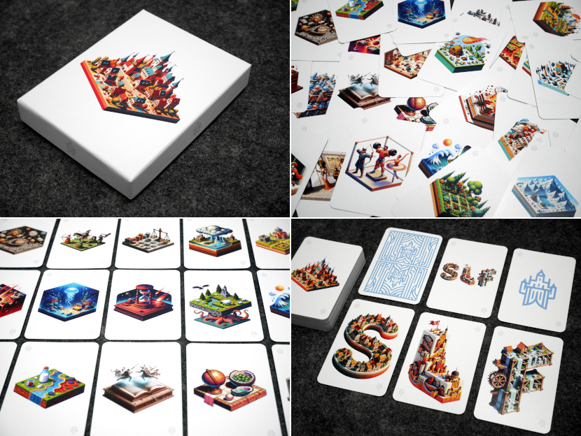

# Stadt, Land, Fluss - Kategoriekarten

([↓ English below ↓](#english))

## Idee

Bei *Stadt, Land, Fluss* kann es dauern, bis man sich Kategorien ausgedacht bzw. auf eine Auswahl geeinigt hat. Die Kategoriekarten können dazu verwendet werden, per Zufall die Kategorien festzulegen, oder sich bei der manuellen Auswahl inspirieren zu lassen.

**[&gt; Online-Version &lt;](https://illdepence.github.io/slf_category_cards/)**

## Daten

* [**Übersicht**]
    * [Karten](illustrations/illustrations.md) - eine Übersicht aller Karten, inklusive Kategorienamen und Prompts
    * [Kategorien](illustrations/illustrations.md) - eine Übersicht aller Kategorien
* **Print**
    * In `pdf/` liegen PDFs für die Kartenvorderseiten, -rückseite, sowie die Box
    * Drucken lassen bei [meinspiel.de](https://www.meinspiel.de/selbstgestaltete-spielkarten-mit-fotos-gestalten-drucken/) als *100% individuelle Spielkarten - 55 Karten - 59x91 mm*
* **SVG**
    * In `svg/` liegen die „Rohdaten“ für die Kartenvorderseite, -rückseite, sowie die Box
    * Erstellt mit Inkscape
* **Fotos**
    * [Box](img/00.jpg)
    * [Rückseite](img/01.jpg)
    * [SLF-Karten](img/02.jpg)
    * [Kategoriekarten (A)](img/03.jpg)
    * [Kategoriekarten (B)](img/04.jpg)

---

# English

## What is this?

*Stadt, Land, Fluss* is the German name of a game basically identical to what’s known in English as *Scattergories*. This repository provides cards that depict categories for the game.

## Idea

When deciding to play *Stadt, Land, Fluss* it can take quite some time to think of or decide on the categories to play with. The cards can be used to either randomly chose categories, or look through them for inspiration.

**[&gt; online version &lt;](https://illdepence.github.io/slf_category_cards/)**

## Data

* [**Overview**]
    * [Cards](illustrations/illustrations.md) - overview of all cards, including category names and prompts
    * [Categories](illustrations/illustrations.md) - overview of all categories (German only)
* **Print**
    * `pdf/` contains PDFs for the card fonts, back, as well as the card box
    * Print ordered at [meinspiel.de](https://www.meinspiel.de/selbstgestaltete-spielkarten-mit-fotos-gestalten-drucken/) as *100% individuelle Spielkarten - 55 Karten - 59*91 mm*
* **SVG**
    * `svg/` contains the “raw data” for the card fonts, back, as well as the card box
    * Created in Inkscape
* **Photos**
    * [Card box](img/00.jpg)
    * [Card back](img/01.jpg)
    * [SLF cards](img/02.jpg)
    * [Category cards (A)](img/03.jpg)
    * [Category cards (B)](img/04.jpg)
