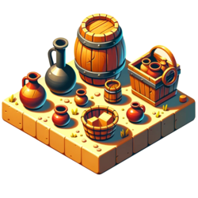
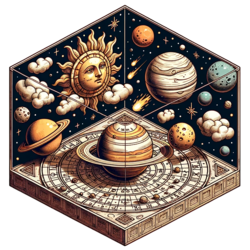
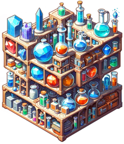
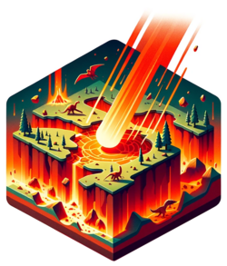
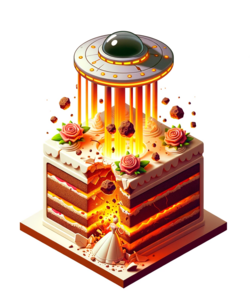

# Kategorien

## Hinweise

* Für jede Kategorie zur Veranschaulichung ein Beispiel einer Konkretisierung durch gültige und ungültige Antowrten.
* Schlussendlich sind es aber alles nur Vorschläge. ;)

<!-- * Am Ende sind zusätzliche Kategorien gelistet, die nicht in den Karten vorhanden sind. -->

## Übersicht

### Stadt

* gültig: Berlin, New York, Shanghai<!--Québec, Xuchang, Yokohama-->
* ungültig: Minas Tirith, Coruscant, Alabastia

### Land
 

* gültig: Deutschland, Mexiko, Japan<!--Costa Rica, Japan, Zypern-->
* ungültig: Afrika, Holland, Narnia

### Fluss

* gültig: Donau, Nil, Amazonas<!--Creuse, Yonne, Zwota-->
* ungültig: Golfstrom, Niagarafälle, Panamakanal

### Berg
  

* gültig: Mount Everest, Kilimandscharo, Matterhorn<!--Cotopaxi, Jungfrau, Zugspitze-->
* ungültig: Bratpfannenberg, Himalaya, Schicksalsberg

### Tier
 

* gültig: Katze, Adler, Spinne<!--Qualle, Stirnlappenbasilisk, Yak-->
* ungültig: Einhorn, Drache, Phönix

### Pflanze

* gültig: Rose, Ahorn, Hagebutte<!--Quellgras, Quitte, Yucca-->
* ungültig: Ent, Koralle, Peitschende Weide

### Beruf
  

* gültig: Gärtner, Polizist, Lehrer<!--Chirurg, Journalist, Zahnarzt-->
* ungültig: Azubi, Marienkäferzüchter, Rentner

### Marke

* gültig: Apple, Gucci, Lego<!--Qualcomm, Xiaomi, Yamaha-->
* ungültig: Macintosh, Oscorp, Passat

### Prominente Person

* gültig: Albert Einstein, Marilyn Monroe, Edward Snowden<!--Anthony Quinn, Donnie Yen, Carl Zeiss-->
* ungültig: Krusty, Sherlock Holmes, Tony Stark

### Sportart

* gültig: Fußball, Tennis, Boxen<!--Curling, Judo, Voltigieren-->
* ungültig: Leichtathletik, Podrennen, Wettessen

### Kleidungsstück

* gültig: Jogginghose, Strohhut, Schal<!--Cargohose, Yukata, Zipfelmütze-->
* ungültig: Superman-Kostüm, Rammstein-T-Shirt, Ziegenfell-Jacke

### Fiktives Werk

* gültig: Star Wars, Krieg und Frieden, Pokemon<!--Quiet Earth, Yogi Bär, Zauberlehrling-->
* ungültig: Eine kurze Geschichte der Zeit, Heiliger Krieg, Tagesschau

### Buch

* gültig: Die Bibel, Hamlet, Alice im Wunderland<!--Carrie, Catch-22, Vom Winde verweht-->
* ungültig: Kindle, New York Times, Zur Elektrodynamik bewegter Körper

### Spiel

* gültig: Schach, Poker, Monopoly<!--Cego, Qwirkle, Yahtzee-->
* ungültig: Lego, Telefonstreich, Weitsprung

### Sprache

* gültig: Deutsch, Englisch, Spanisch<!--Japanisch, Quechua, Zulu-->
* ungültig: Bolivianisch, Indisch, Plattdeutsch

### Werkzeug

* gültig: Hammer, Zange, Feile<!--Quirl, Quadrant, Zange-->
* ungültig: Bosch-Flex, Hand, Leatherman

### Waffe

* gültig: Schwert, Pistole, Bombe<!--Chakram, Claymore, Zweihänder-->
* ungültig: Faust, Glasscherbe, Stift

### Straftat

* gültig: Dienbstahl, Mord, Steuerhinterziehung<!--Computerbetrug, Vandalismus, Zuhälterei-->
* ungültig: Bananen-Diebstahl, Lügen, Supermarkt-Einbruch

### Währung

* gültig: Euro, US-Dollar, Rubel<!--Colón, Jamaika-Dollar, Vatu-->
* ungültig: Credits, Goldstücke, Scheine

### Flüssigkeit

* gültig: Wasser, Benzin, Tinte<!--Chloroform, Quecksilber, Öl-->
* ungültig: Apfelsaft, Pepsi, Stickstoff

### Fortbewegungsmittel

* gültig: Fahrrad, Auto, Flugzeug<!--Quad, Yacht, Zeppelin-->
* ungültig: Jeep, Mitfahrgelegenheit, Uber

### Krankheit

* gültig: Malaria, Krebs, Lepra<!--Cholera, COVID-19, Zöliakie-->
* ungültig: Juckreiz, Knochenbruch, Rücken

### Behälter

* gültig: Becher, Rucksack, Container<!--Jutebeutel, Zeitkapsel, Zündholzschachtel-->
* ungültig: Mund, Samsonite-Koffer, Zimmer

### Himmelskörper

* gültig: Mars, Mond, Milchstraße
* ungültig: Wolke, Gasriese, Schwarzes Loch

### Gebäudeart

* gültig: Wohnhaus, Bahnhof, Wolkenkratzer
* ungültig: Pentagon, Wohnsieldung, Designerhaus

### Stromquelle

* gültig: elektrischer Aal, Dynamo, Batterie
* ungültig: Duracell, Ladekabel, Flux-Kondensator

### Tierische Fähigkeit

* gültig: Fliegen, Echolokation, Biolumineszenz
* ungültig: Feuerspeien, Unsichtbarkeit, Laufen

### Chemisches Element
 

* gültig: Wasserstoff, Helium, Eisen<!--Quecksilber, Xenon, Yttrium-->
* ungültig: Messing, Unobtainium, Wasser

### Gesteinsart

* gültig: Marmor, Smaragd, Kohle
* ungültig: Beton, Fels, Kiesel

### Etwas das Fliegt
 

* gültig: Biene, Flugzeug, Komet
* ungültig: Boeing 747, Magnet, Apfel

### Etwas Rundes
 

* gültig: Kokosnuss, Perle, Globus
* ungültig: Pringlesdose, Schlange, Schutzschild

### Gruppenbezeichnung
 

* gültig: Paar, Duo, Bande
* ungültig: Al-Qaida, ABBA, Bundesregierung

### Zeitspanne
 

* gültig: Sekunde, Quartal, Dekade
* ungültig: Gestern, Mathestunde, Selbstfindungsphase

### Naturphänomen

* gültig: Regen, Donner, Nordlicht
* ungültig: Schwerkraft, Smog, Tiere

### Naturkatastrophe
 

* gültig: Erdbeben, Hurrikan, Tsunami
* ungültig: Regen, Weltuntergang, Asteroid

### Katastrophe
 

* gültig: Atomkrieg, Hungersnot, Börsencrash
* ungültig: Handyverlust, Stromausfall, Autopanne
