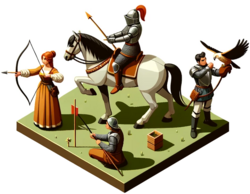
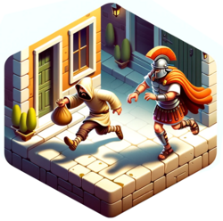
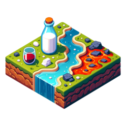
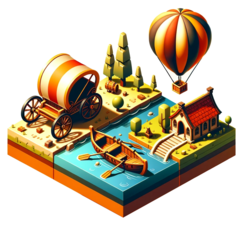
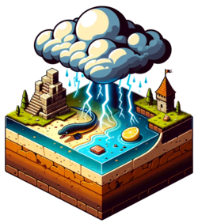
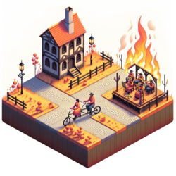
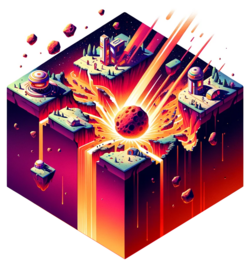

# Kategorien

## Hinweise

* Für jede Kategorie sind zur Veranschaulichung Beispiele valider Antworten und Beispiele invalider Antowrten.
* Schlussendlich sind es aber alles nur Vorschläge. ;)
* Am Ende sind zusätzliche Kategorien gelistet, die nicht in den Karten vorhanden sind.

## Übersicht

### Stadt

* valide: Berlin, New York, Shanghai<!--Québec, Xuchang, Yokohama-->
* invalide: Minas Tirith, Coruscant, Alabastia

### Land
 

* valide: Deutschland, Mexiko, Japan<!--Costa Rica, Japan, Zypern-->
* invalide: Afrika, Holland, Narnia

### Fluss

* valide: Donau, Nil, Amazonas<!--Creuse, Yonne, Zwota-->
* invalide: Golfstrom, Niagarafälle, Panamakanal

### Berg
  

* valide: Mount Everest, Kilimandscharo, Matterhorn<!--Cotopaxi, Jungfrau, Zugspitze-->
* invalide: Bratpfannenberg, Himalaya, Schicksalsberg

### Tier
 

* valide: Katze, Adler, Spinne<!--Qualle, Stirnlappenbasilisk, Yak-->
* invalide: Einhorn, Drache, Phönix

### Pflanze

* valide: Rose, Ahorn, Hagebutte<!--Quellgras, Quitte, Yucca-->
* invalide: Ent, Koralle, Peitschende Weide

### Beruf
  

* valide: Gärtner, Polizist, Lehrer<!--Chirurg, Journalist, Zahnarzt-->
* invalide: Azubi, Marienkäferzüchter, Rentner

### Marke

* valide: Apple, Gucci, Lego<!--Qualcomm, Xiaomi, Yamaha-->
* invalide: Macintosh, Oscorp, Passat

### Prominente Person

* valide: Albert Einstein, Marilyn Monroe, Edward Snowden<!--Anthony Quinn, Donnie Yen, Carl Zeiss-->
* invalide: Krusty, Sherlock Holmes, Tony Stark

### Sportart

* valide: Fußball, Tennis, Boxen<!--Curling, Judo, Voltigieren-->
* invalide: Leichtathletik, Podrennen, Wettessen

### Kleidungsstück

* valide: Cargohose, Yukata, Zipfelmütze
* invalide: Superman-Kostüm, Rammstein-T-Shirt, Ziegenfell-Jacke

### Fiktives Werk

* valide: Quiet Earth, Yogi Bär, Zauberlehrling
* invalide: Eine kurze Geschichte der Zeit, Heiliger Krieg, Tagesschau

### Buch

* valide: Carrie, Catch-22, Vom Winde verweht
* invalide: Kindle, New York Times, Zur Elektrodynamik bewegter Körper

### Spiel

* valide: Cego, Qwirkle, Yahtzee
* invalide: Lego, Telefonstreich, Weitsprung

### Sprache

* valide: Japanisch, Quechua, Zulu
* invalide: Bolivianisch, Indisch, Plattdeutsch

### Werkzeug

* valide: Quirl, Quadrant, Zange
* invalide: Bosch-Flex, Hand, Leatherman

### Waffe

* valide: Chakram, Claymore, Zweihänder
* invalide: Faust, Glasscherbe, Stift

### Straftat

* valide: Computerbetrug, Vandalismus, Zuhälterei
* invalide: Bananen-Diebstahl, Lügen, Supermarkt-Einbruch

### Währung

* valide: Colón, Jamaika-Dollar, Vatu
* invalide: Credits, Goldstücke, Scheine

### Flüssigkeit

* valide: Chloroform, Quecksilber, Öl
* invalide: Apfelsaft, Pepsi, Stickstoff

### Fortbewegungsmittel

* valide: Quad, Yacht, Zeppelin
* invalide: Jeep, Mitfahrgelegenheit, Uber

### Krankheit

* valide: Cholera, COVID-19, Zöliakie
* invalide: Juckreiz, Knochenbruch, Rücken

### Behälter

* valide: Jutebeutel, Zeitkapsel, Zündholzschachtel
* invalide: Mund, Samsonite-Koffer, Zimmer

### Himmelskörper

* valide: 
* invalide: 

### Gebäudeart

* valide: 
* invalide: 

### Stromquelle

* valide: 
* invalide: 

### Tierische Fähigkeit

* valide: 
* invalide: 

### Chemisches Element
 

* valide: Quecksilber, Xenon, Yttrium
* invalide: Messing, Unobtainium, Wasser

### Gesteinsart

* valide: 
* invalide: 

### Etwas das Fliegt
 

* valide: 
* invalide: 

### Etwas Rundes
 

* valide: 
* invalide: 

### Gruppenbezeichnung
 

* valide: 
* invalide: 

### Zeitspanne
 

* valide: 
* invalide: 

### Naturphänomen

* valide: 
* invalide: 

### Naturkatastrophe
 

* valide: 
* invalide: 

### Katastrophe
 

* valide: 
* invalide: 

### Undefiniert

* valide: 
* invalide: 
