# Kategorien

## Hinweise

* Für jede Kategorie sind zur Veranschaulichung Beispiele valider Antworten und Beispiele invalider Antowrten.
* Schlussendlich sind es aber alles nur Vorschläge. ;)
* Am Ende sind zusätzliche Kategorien gelistet, die nicht in den Karten vorhanden sind.

## Übersicht

### Stadt

* valide: Berlin, New York, Shanghai<!--Québec, Xuchang, Yokohama-->
* invalide: Minas Tirith, Coruscant, Alabastia

### Land
 

* valide: Deutschland, Mexiko, Japan<!--Costa Rica, Japan, Zypern-->
* invalide: Afrika, Holland, Narnia

### Fluss

* valide: Donau, Nil, Amazonas<!--Creuse, Yonne, Zwota-->
* invalide: Golfstrom, Niagarafälle, Panamakanal

### Berg
  

* valide: Mount Everest, Kilimandscharo, Matterhorn<!--Cotopaxi, Jungfrau, Zugspitze-->
* invalide: Bratpfannenberg, Himalaya, Schicksalsberg

### Tier
 

* valide: Katze, Adler, Spinne<!--Qualle, Stirnlappenbasilisk, Yak-->
* invalide: Einhorn, Drache, Phönix

### Pflanze

* valide: Rose, Ahorn, Hagebutte<!--Quellgras, Quitte, Yucca-->
* invalide: Ent, Koralle, Peitschende Weide

### Beruf
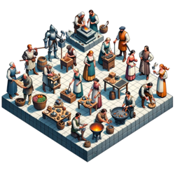  

* valide: Gärtner, Polizist, Lehrer<!--Chirurg, Journalist, Zahnarzt-->
* invalide: Azubi, Marienkäferzüchter, Rentner

### Marke

* valide: Apple, Gucci, Lego<!--Qualcomm, Xiaomi, Yamaha-->
* invalide: Macintosh, Oscorp, Passat

### Prominente Person
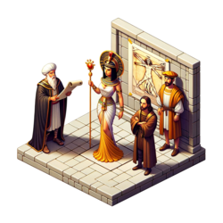

* valide: Albert Einstein, Marilyn Monroe, Edward Snowden<!--Anthony Quinn, Donnie Yen, Carl Zeiss-->
* invalide: Krusty, Sherlock Holmes, Tony Stark

### Sportart

* valide: Fußball, Tennis, Boxen<!--Curling, Judo, Voltigieren-->
* invalide: Leichtathletik, Podrennen, Wettessen

### Kleidungsstück
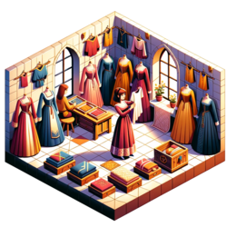

* valide: Jogginghose, Strohhut, Schal<!--Cargohose, Yukata, Zipfelmütze-->
* invalide: Superman-Kostüm, Rammstein-T-Shirt, Ziegenfell-Jacke

### Fiktives Werk
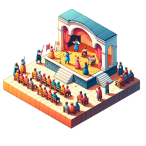

* valide: Star Wars, Krieg und Frieden, Pokemon<!--Quiet Earth, Yogi Bär, Zauberlehrling-->
* invalide: Eine kurze Geschichte der Zeit, Heiliger Krieg, Tagesschau

### Buch

* valide: Die Bibel, Hamlet, Alice im Wunderland<!--Carrie, Catch-22, Vom Winde verweht-->
* invalide: Kindle, New York Times, Zur Elektrodynamik bewegter Körper

### Spiel
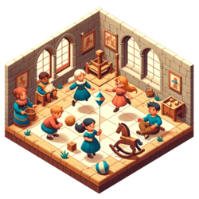

* valide: Schach, Poker, Monopoly<!--Cego, Qwirkle, Yahtzee-->
* invalide: Lego, Telefonstreich, Weitsprung

### Sprache

* valide: Deutsch, Englisch, Spanisch<!--Japanisch, Quechua, Zulu-->
* invalide: Bolivianisch, Indisch, Plattdeutsch

### Werkzeug

* valide: Hammer, Zange, Feile<!--Quirl, Quadrant, Zange-->
* invalide: Bosch-Flex, Hand, Leatherman

### Waffe
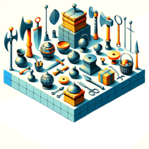

* valide: Schwert, Pistole, Bombe<!--Chakram, Claymore, Zweihänder-->
* invalide: Faust, Glasscherbe, Stift

### Straftat

* valide: Dienbstahl, Mord, Steuerhinterziehung<!--Computerbetrug, Vandalismus, Zuhälterei-->
* invalide: Bananen-Diebstahl, Lügen, Supermarkt-Einbruch

### Währung

* valide: Euro, US-Dollar, Rubel<!--Colón, Jamaika-Dollar, Vatu-->
* invalide: Credits, Goldstücke, Scheine

### Flüssigkeit

* valide: Wasser, Benzin, Tinte<!--Chloroform, Quecksilber, Öl-->
* invalide: Apfelsaft, Pepsi, Stickstoff

### Fortbewegungsmittel

* valide: Fahrrad, Auto, Flugzeug<!--Quad, Yacht, Zeppelin-->
* invalide: Jeep, Mitfahrgelegenheit, Uber

### Krankheit

* valide: Malaria, Krebs, Lepra<!--Cholera, COVID-19, Zöliakie-->
* invalide: Juckreiz, Knochenbruch, Rücken

### Behälter

* valide: Becher, Rucksack, Container<!--Jutebeutel, Zeitkapsel, Zündholzschachtel-->
* invalide: Mund, Samsonite-Koffer, Zimmer

### Himmelskörper

* valide: Mars, Mond, Milchstraße
* invalide: Wolke, Gasriese, Schwarzes Loch

### Gebäudeart

* valide: Wohnhaus, Bahnhof, Wolkenkratzer
* invalide: Pentagon, Wohnsieldung, Designerhaus

### Stromquelle

* valide: elektrischer Aal, Dynamo, Batterie
* invalide: Duracell, Ladekabel, Flux-Kondensator

### Tierische Fähigkeit

* valide: Fliegen, Echolokation, Biolumineszenz
* invalide: Feuerspeien, Unsichtbarkeit, Laufen

### Chemisches Element
 

* valide: Wasserstoff, Helium, Eisen<!--Quecksilber, Xenon, Yttrium-->
* invalide: Messing, Unobtainium, Wasser

### Gesteinsart

* valide: Marmor, Smaragd, Kohle
* invalide: Beton, Fels, Kiesel

### Etwas das Fliegt
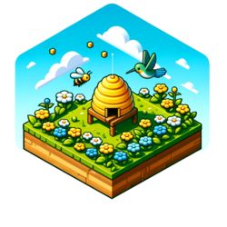 

* valide: Biene, Flugzeug, Komet
* invalide: Boeing 747, Magnet, Apfel

### Etwas Rundes
 

* valide: Kokosnuss, Perle, Globus
* invalide: Pringlesdose, Schlange, Schutzschild

### Gruppenbezeichnung
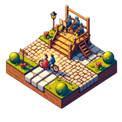 

* valide: Paar, Duo, Bande
* invalide: Al-Qaida, ABBA, Bundesregierung

### Zeitspanne
 

* valide: Sekunde, Quartal, Dekade
* invalide: Gestern, Mathestunde, Selbstfindungsphase

### Naturphänomen
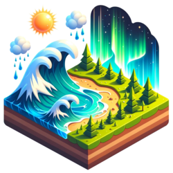

* valide: Regen, Donner, Nordlicht
* invalide: Schwerkraft, Smog, Tiere

### Naturkatastrophe
 

* valide: Erdbeben, Hurrikan, Tsunami
* invalide: Regen, Weltuntergang, Asteroid

### Katastrophe
 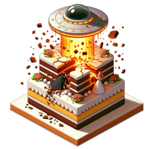

* valide: Atomkrieg, Hungersnot, Börsencrash
* invalide: Handyverlust, Stromausfall, Autopanne

### Undefiniert
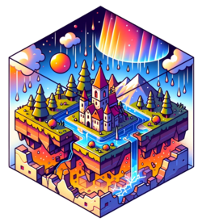

* valide: -
* invalide: -
