# Illustrations

### Notes

* All illustrations were created using ChatGPT (GPT-4) with DALL·E 3 between Oct 29 and Nov 12 2023.
* Because the DALL·E backend changed within this time frame ([see OpenAI forum thread](https://community.openai.com/t/after-upgrade-seeds-doesnt-work-generation-id-is-introduced/462161)) there’s no common set of parameters retrievable. For the some it would be a `seed`, for others a `generation_id`. For the moment I therefore opted to just gather all the prompts used and list them below.
* In most of the generated images the square base dropped a shadow on the white background. I removed them manually to make the cards visually more consistent.
* The images below are downscaled. You can find the full-scale versions in the [PDF](../pdf/card_front_all.pdf) and [SVG](../svg/card_front.svg).
* All images are licensed [CC-BY-SA](https://creativecommons.org/licenses/by-sa/4.0/)

### Overview

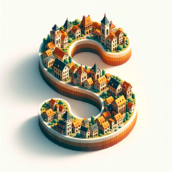  
Name: **stadt “s”** / “s” as in the German word for city (“Stadt”)  
Prompt: `Isometric depiction of a letter 'S' floating against a stark white backdrop. This unique 'S' is not just a letter, but a medieval townscape in itself. Its contours and curves are filled with buildings and greenery that radiate warm colors, smooth, rounded shapes, and a playful, imaginative design. The town's composition within the 'S' form is layered, presenting elements in the front, middle, and back, creating an atmosphere of warmth and charm.`

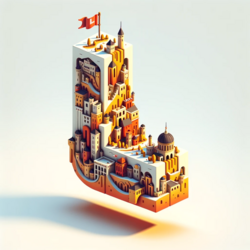  
Name: **land “l”** / “l” as in the German word for country (“Land”)  
Prompt: `Isometric depiction of a letter 'L' floating against a stark white backdrop. This unique 'L' is not just a letter, but a medieval empire in itself. Its contours and curves are filled with cities, infrastructure, and a flag atop that radiate warm colors, smooth, rounded shapes, and a playful, imaginative design. The empire's composition within the 'L' form is layered, presenting elements in the front, middle, and back, creating an atmosphere of warmth and charm.`

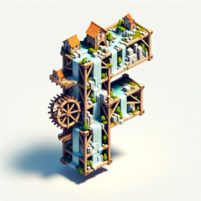  
Name: **fluss “f”** / “f” as in the German word for river (“Fluss”)  
Prompt: `Isometric depiction of a letter 'F' floating against a stark white backdrop. This unique 'F' is not just a letter, but a medieval scaffolding in itself. Its contours and curves are filled with rushing waterfalls, greenery, and small makeshift mills that radiate chill colors, smooth, rounded shapes, and a playful, imaginative design. The scaffolding's composition within the 'F' form is layered, presenting elements in the front, middle, and back, creating an atmosphere of warmth and charm.`

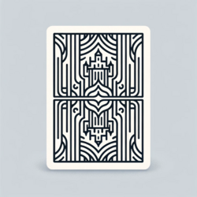  
Name: **rückseite** / back  
Prompt: `An illustration depicting the back of a playing card. The design features a monochrome line pattern that is symmetrical both vertically and horizontally. In the center, there is a stylized silhouette of a simplified medieval city, also created using line art. The overall aesthetic should convey elegance and simplicity, with a focus on symmetry and clean lines.`

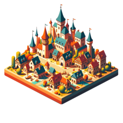  
Name: **stadt** / city  
Prompt: `Illustration of a medieval city in an isometric view, placed on a small quadratic plate that's floating in mid-air against a pure white background. Ensure there is no shadow under the plate. The city has bright, saturated colors and smooth, rounded shapes for a soft, friendly appearance. The structures are simplified and stylized, hinting at a playful and imaginative atmosphere. The scene avoids intricate details, focusing instead on bold shapes and silhouettes. The composition is layered with elements in the foreground, middle-ground, and background, giving depth to the scene. The overall ambiance is one of wonder, warmth, and coziness.`

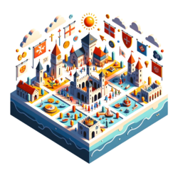  
Name: **land** / country  
Prompt: `Illustration of the concept of a 'nation state' depicted in an isometric square, floating against a white background. The setting is medieval, but instead of a city, symbols and elements representing the idea of a unified nation under one government are displayed. The art style is characterized by bright, saturated colors, smooth, rounded shapes, and stylized structures, evoking feelings of unity, identity, and sovereignty.`

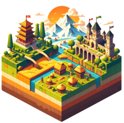  
Name: **land** / country  
Prompt: `Illustration of an isometric square floating against a pure white background. Within the square, an landscape of three visually distinct countries in a medieval setting is depicted. Situated the left is an Asian country with rice fields and pagodas. On the right is a western country boasting a viaduct and a castle. In the front center is an African country with straw huts and observation towers. Each country in the left, right, and center features a small flag flying atop one of their buildings. The colors are bright and saturated, the shapes are smooth and rounded, and the entire scene exudes warmth and coziness.`

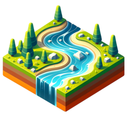  
Name: **fluss** / river  
Prompt: `Illustration of a flowing river set within a floating isometric square, set against a pure white background with no shadow underneath. The river reflects the medieval setting style with bright, saturated colors and smooth, rounded shapes. The water is depicted in a stylized manner, hinting at a playful and imaginative atmosphere. The scene avoids intricate details, focusing instead on the soft ripples and curves of the river, evoking feelings of wonder and tranquility.`

  
Name: **berg** / mountain  
Prompt: `Illustration of a mountain range in an isometric view, placed on a small quadratic plate that's floating in mid-air against a pure white background. Ensure there is no shadow under the plate. The mountain range has bright, saturated colors and smooth, rounded shapes, giving it a soft, friendly appearance typical of a medieval setting. The mountains are simplified and stylized, suggesting a playful and imaginative atmosphere. The scene avoids intricate details, focusing instead on bold shapes and silhouettes. The overall ambiance is one of wonder, warmth, and coziness.`

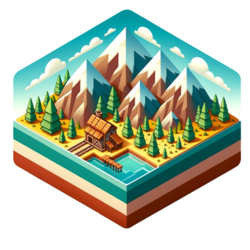  
Name: **berg** / mountain   
Prompt: `Illustration of an isometric square floating against a pure white background. Within the square, a mountain range in a medieval setting is depicted. The mountain range features peaks of various heights filling the whole square. On the mountain range at medium elevation is a small, wooden mining hut. Close to the mining hut is a blue mountain lake. The colors are bright and saturated, the shapes are smooth and rounded, and the entire scene exudes warmth and coziness.`

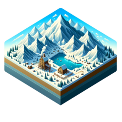  
Name: **berg** / mountain  
Prompt: `Illustration of an isometric square floating against a pure white background. Within the square, a wide, intricate mountain range in a medieval setting is depicted. The mountain range features peaks of various heights filling the whole square. On the mountain range at high elevation is a small, wooden mining hut surrounded by snow. Close to the mining hut is a blue mountain lake. The colors are bright and saturated, the shapes are smooth and rounded, and the entire scene exudes warmth and coziness.`

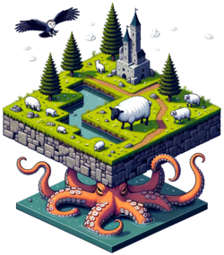  
Name: **tier** / animal  
Prompt: `Illustration of a floating isometric square set against a pure white backdrop. The land, reflecting a medieval ambiance, features a sheep wandering and munching on the grass. In contrast, a giant octopus' tentacles rise from a pond, reaching out playfully. Overhead, owls fly in a formation, casting shadows on the ground below.`

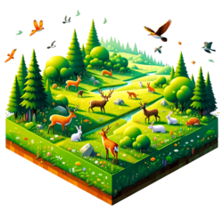  
Name: **tier** / animal  
Prompt: `Illustration depicting a serene meadow inside a floating isometric square, set against a stark white backdrop with no shadow. The meadow is lush and verdant, teeming with diverse animals like deer of different genders and descent, rabbits hopping around, diverse birds flying above, and a playful fox lurking nearby. The scene exudes a medieval aesthetic with its bright, saturated hues, rounded and friendly designs, and a sense of tranquil harmony.`

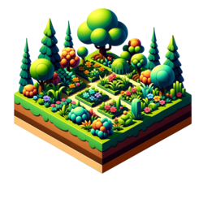  
Name: **pflanze** / plant  
Prompt: `Illustration of a floating isometric square set against a stark white backdrop with no shadow beneath. Within this square is a lush garden inspired by medieval aesthetics. The garden gleams with bright, saturated hues and features an assortment of trees, bushes, flowers, and other plants. The vegetation boasts smooth, rounded designs that exude friendliness, and the playful and imaginative setting is underscored by the stylized, simplified plant life. The garden avoids intricate detailing in favor of bold, clear silhouettes, evoking feelings of wonder and snug comfort.`

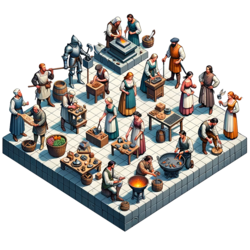  
Name: **beruf** / profession  
Prompt: `Illustration in an isometric view of a floating square set against a white background, depicting a medieval town square. The square is bustling with ten individuals of various professions: a blacksmith forging metal, a female baker holding a loaf, an armored knight, a male tailor measuring fabric, a female herbalist sorting her herbs, a male carpenter working on a wooden piece, a female potter displaying her pottery, a male musician strumming a lute, a female dancer performing a dance, and a male fisherman showcasing his catch. The atmosphere is vibrant, capturing the spirit of medieval trade.`

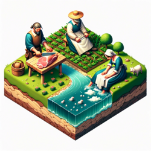  
Name: **beruf** / profession  
Prompt: `Illustration showcasing three medieval figures on a small piece of flat land floating isometrically against a white background. The land features a river that bisects it from north to south. On the land's west side, a male butcher in medieval garb is engaged in slicing a small pork chop on a chopping block. Opposite him, on the east side, sits a farmer with a straw hat planting crops in his field. In the middle, at the riverbank, knees a laundress, who is actively washing white clothes in the river's water. This pastoral scene captures the essence of their trades.`

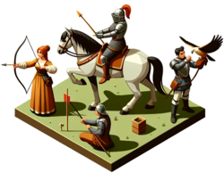  
Name: **beruf** / profession  
Prompt: `Illustration set in a floating isometric square in a medieval setting, showcasing three small diverse groups of people. The first group consists of a man and a woman practicing archery, with bows and arrows in hand, aiming at distant targets. The second group, with two women and a man, is engaged in jousting, wearing armor and holding lances atop horses. The third group, comprising two men and a woman, is partaking in falconry, with each person holding a bird of prey on their arm.`

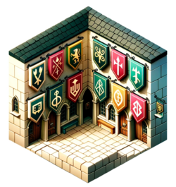  
Name: **marke** / brand  
Prompt: `Illustration set within a floating isometric square showcasing a medieval narrow street corner against a white background. Prominently displayed on the corner are large sigils of different trades, each designed to evoke the feel of modern brand logos. The scene blends the medieval ambiance with a touch of contemporary design, using bright colors and smooth, rounded forms. The overall composition is playful and imaginative, focusing on the sigils as the main attraction.`

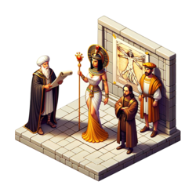  
Name: **prominente person** / famous person  
Prompt: `Illustration of a small isometric square floating in front of a white background. Upon the square, three figures stand. One is dressed as Cleopatra, adorned with a golden headdress and a scepter. Another figure is dressed in the style of Leonardo da Vinci, wearing a Renaissance robe and holding a rolled-up sketch. The third person combines elements of both costumes, creating a unique blend of ancient Egypt and Renaissance Italy. The overall setting retains the medieval ambiance.`

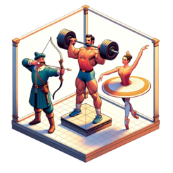  
Name: **sportart** / type of sport  
Prompt: `Illustration set in an isometric square floating on a white backdrop. The scene, inspired by a medieval ambiance, showcases three individuals: a European archer taking aim with his bow, a weightlifter of Hispanic descent showcasing his strength by lifting a massive weight, and a ballet dancer of Middle Eastern descent elegantly dancing in the center. The entire scene is adorned with vivid colors, and the characters are depicted with stylized, simplified details in line with the medieval art style.`

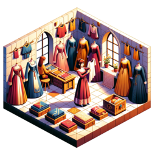  
Name: **kleidungsstueck** / clothing item  
Prompt: `Illustration depicting an isometric view of a medieval-styled room on a floating quadratic plate against a stark white backdrop with no shadow. In this room, a young woman is exploring a collection of different clothing options. She holds up a dress while examining it, and around her are other medieval garments spread out. The scene is filled with bright, saturated hues, and the designs are smooth and rounded, exuding a sense of warmth and coziness.`

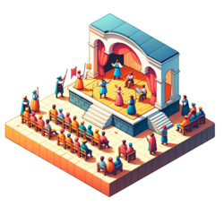  
Name: **fiktives werk** / work of fiction  
Prompt: `Illustration of an open-air theater play being performed on a small stage set in a medieval setting, placed on a floating isometric square. The stage is set against a pure white background with no shadow beneath the square. Actors are on the stage enacting a scene, while a handful of observers watch the performance. Everything is depicted in bright, saturated colors with smooth, rounded shapes for a soft, friendly appearance. The structures and characters are simplified and stylized, hinting at a playful and imaginative atmosphere. The scene avoids intricate details, focusing instead on bold shapes and silhouettes.`

  
Name: **buch** / book  
Prompt: `Illustration of an isometric wooden base floating against a pure white background. On the plate, there is a magnificent opened book with intricate ornaments at its edges. The pages of the book display detailed illustrations and writings. Above the pages, floating in the air, is a nebulous depiction of two gladiators in combat, one being struck down, their forms ethereal and ghostly, as if they are emerging from the stories told within the book.`

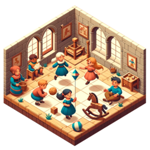  
Name: **spiel** / game  
Prompt: `Illustration of a floating isometric square set in a medieval setting. On the square, there are four children of diverse descent and gender, each engaged in different activities. Two of the children, one boy and one girl, are playing catch with a ball. Another child, a girl, is joyfully flying a kite, while the fourth child, a younger boy, is gleefully riding a wooden rocking horse. The atmosphere is playful and warm, with the children immersed in their activities.`

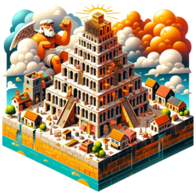  
Name: **sprache** / language  
Prompt: `Illustration of an isometric square floating against a pure white background. On the square, a city in a medieval setting is depicted. In the center of the city, the Tower of Babel is being constructed. The under construction tower with makeshift scaffolding and various people working on it is soaring high into the clouds. In the clouds the angry Christian god is frowning upon the tower, shaking his fist. The colors are bright and saturated, the shapes are smooth and rounded, and the entire scene exudes warmth and coziness.`

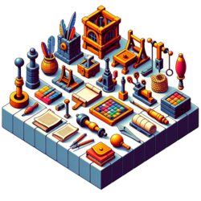  
Name: **werkzeug** / tool  
Prompt: `Illustration of a floating isometric square set against a pure white background. Within this square, tools from a medieval setting are displayed, ranging in sophistication, materials, and sizes. Starting from a simple rope, the collection progresses to include drawing utensils such as quills and parchment, and culminates with a large wine press. The style maintains the bright, saturated colors and smooth, rounded shapes characteristic of the previous city image, giving an overall playful and imaginative feel.`

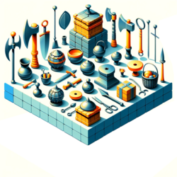  
Name: **waffe** / weapon  
Prompt: `Illustration showcasing a collection of medieval tools and weapons on a floating isometric quadratic plate. Set against a stark white backdrop with no shadow beneath, the items gleam with bright, saturated hues. They boast smooth, rounded designs that exude friendliness. The playful and imaginative setting is underscored by the stylized, simplified designs of the tools and weapons, which avoid intricate detailing in favor of bold, clear silhouettes. The overall ambiance is one of historical intrigue and snug comfort.`

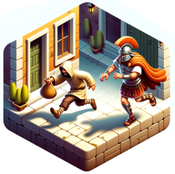  
Name: **straftat** / crime  
Prompt: `Illustration of an isometric square floating against a pure white background. On the square, a scene of pickpocketing on a small street in an ancient Rome setting is depicted. The pickpocket, wearing a torn hooded robe, is fleeing from a Roman soldier in full armor and helmet. The pickpocket is the main focus, with both characters clearly visible. The colors are bright and saturated, the shapes smooth and rounded, exuding a sense of warmth and coziness.`

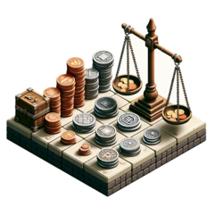  
Name: **waerung** / currency  
Prompt: `Isometric view illustration on a floating square set in a medieval theme. Displayed on the square are various coins of different materials and designs, with some coins stacked upon each other. Next to the coins is an antique wooden bar scale, reminiscent of medieval times. The entire scene is placed against a pristine white background.`

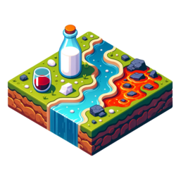  
Name: **fluessigkeit** / liquid  
Prompt: `Illustration of an isometric square floating in a white background. The square portrays a medieval setting with a piece of land that has a flowing stream of water. On this land, there's a bottle of milk placed next to a small puddle of lava. Nearby, there's a glass filled with red wine. The colors are bright and saturated, with smooth, rounded shapes giving a soft and friendly appearance.`

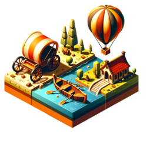  
Name: **fortbewegungsmittel** / mode of transportation  
Prompt: `Illustration depicting a floating isometric square with a medieval ambiance against a stark white backdrop. The square showcases three modes of medieval transportation: a detailed chariot resting on the ground, a wooden rowing boat navigating a calm river, and a colorful hot air balloon hovering in the sky. The designs use bright and saturated colors, smooth shapes, and simplified forms to create a warm, cozy, and imaginative setting.`

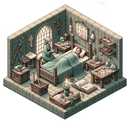  
Name: **krankheit** / illness  
Prompt: `Illustration in an isometric view on a floating square, set in a medieval theme, representing illness. The square portrays a scene where a person lies in bed, appearing weak and unwell, with a concerned family member at their side. Nearby, there are medieval medical tools, scrolls with remedies, and a candle that casts a gentle glow. The scene uses muted colors to convey the gravity of illness but maintains the playful and imaginative style of the medieval setting.`

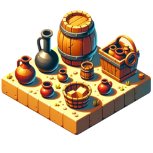  
Name: **behälter** / container  
Prompt: `Illustration showing a floating isometric square with no shadow, set in a medieval theme. Upon the square are a variety of containers playfully organized. These include a large wooden barrel, a tall metal jug, a small clay pot, and a woven basket, each differing in size and material. The overall design is characterized by bright, saturated colors, smooth, rounded forms, and a stylized, simplified appearance, all contributing to a sense of wonder and warmth.`

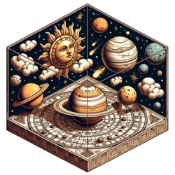  
Name: **himmelskoerper** / celestial body  
Prompt: `Illustration set within a floating isometric square in a medieval art style. Depicting the cosmos as imagined in ancient times, the scene includes the sun, Saturn with its distinct rings, a moon, and a comet. Each celestial body has indications of their trajectories, reminiscent of old depictions where the heavens are visualized as a half-circle enclosure above the Earth. The overall design should convey the charm of antique astronomical drawings with a playful and imaginative setting.`

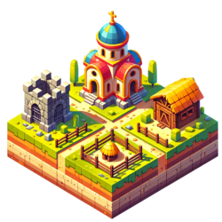  
Name: **gebäudeart** / type of building  
Prompt: `Illustration depicting a floating isometric square set in a medieval ambiance. This square holds four distinct structures: a vibrant church with rounded features, a stone prison with barred windows, a simple wooden hut with a thatched roof, and a stable fit for animals. The design is characterized by bright colors, stylized forms, and an absence of intricate details, all set against a stark white backdrop.`

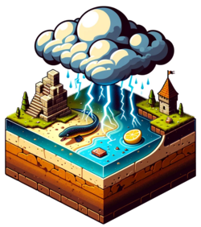  
Name: **stomquelle** / source of electricity  
Prompt: `An isometric illustration of a floating square against a white backdrop, featuring a medieval theme. This square depicts a piece of land under a damp atmosphere with a thunderstorm cloud overhead from which realistic lightning is striking down. An electric eel is residing within a small pond on this land. Additionally, there is a lemon placed upon a small patch of dirt, with a piece of zinc and copper sticking out of the lemon. The illustration has saturated colors and a stylized, layered composition that evokes a sense of wonder and imagination.`

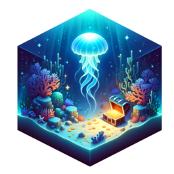  
Name: **tierische faehigkeit** / animal ability  
Prompt: `Illustration of an isometric square floating against a pure white background. Within the square, a bioluminescent jellyfish in a medieval underwater setting is depicted. The swift creature is surrounded by an aura of soft, glowing light, illuminating a sunken treasure chest and scattered coins on the ocean floor. Corals in the backdrop add to the mysterious ambiance. The light from the bioluminescent creature casts a serene glow on its surroundings, creating a contrast with the dark depths of the sea. The colors are bright and saturated, highlighting the luminous blues, greens, and purples of the creature and its environment. The shapes are smooth and rounded, capturing the fluidity of underwater life. The entire scene exudes warmth and coziness, turning a deep-sea scenario into a comforting and enchanting spectacle. The background is pure white.`

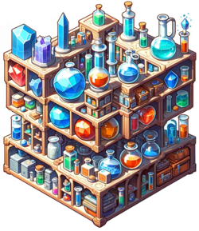  
Name: **chemisches element** / chemical element  
Prompt: `Create an illustration in an isometric view of an oddly shaped storage frame, floating against a white backdrop, with no shadow. This frame is part of a medieval setting and is filled with containers and shelves of various sizes and shapes. It holds a collection of all chemical elements in their natural forms, including solid rocks and crystals, liquids in medieval-style glassware, and gases contained in transparent, sealed vessels. The style should be consistent with bright, saturated colors, smooth shapes, and stylized, simplified forms, evoking a sense of wonder and an imaginative atmosphere.`

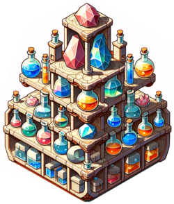  
Name: **chemisches element** / chemical element  
Prompt: `Create an isometric illustration of an oddly shaped storage frame floating against a white background with no shadow, in a medieval style. The frame should have containers and shelves of different sizes and shapes, each holding the chemical elements in their natural forms: solid rocks and crystals, liquids in medieval-style vials, and gases in transparent, sealed containers. The artwork should have bright, saturated colors and smooth, rounded shapes with a playful and imaginative feel. There should be no intricate details, focusing instead on the bold shapes and layered composition of the elements within the frame.`

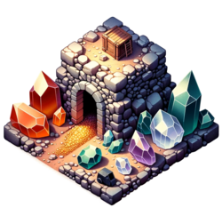  
Name: **gesteinsart** / type of rock or mineral  
Prompt: `Illustration of an isometric square, floating against a pure white background, set in a medieval style. Within the square is a craggy landscape featuring an entry to a mine shaft. Scattered around the entrance are deposits of gold, quartz, amethyst, and coal. The colors are bright and saturated, and the shapes of the minerals are smooth and rounded, evoking a sense of wonder and curiosity.`

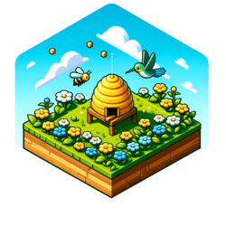  
Name: **etwas das fliegt ** / something that flies  
Prompt: `Illustration of an isometric square floating against a pure white background. Within the square, a small meadow in a medieval setting is depicted. On a meadow on the right, stands a dome shaped yellow bee hive with entrance, busy bees buzzing around are making honey. Opposite of the hive on the left, a blue green hummingbird is feeding in a flower. In the sky there are clouds. The colors are bright and saturated, the shapes are smooth and rounded, and the entire scene exudes warmth and coziness.`

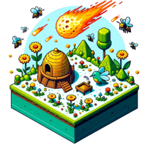  
Name: **etwas das fliegt** / something that flies  
Prompt: `Illustration of an isometric square floating against a pure white background. Within the square, a small meadow in a medieval setting is depicted. On a meadow on the right, stands a dome shaped yellow bee hive with entrance, busy bees buzzing around are making honey. Opposite of the hive on the left, a blue green hummingbird is feeding in a flower. In the sky there are small bees and huge fire ball flaming meteorites striking down into the meadow, wreaking havoc. The colors are bright and saturated, the shapes are smooth and rounded, and the entire scene exudes warmth and coziness.`

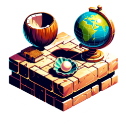  
Name: **etwas rundes** / something round  
Prompt: `Illustration with bright and saturated style, depicting an isometric square floating against a white background. The square features a wooden tabletop with a medieval ambiance. On the left side of the table is a round coconut, unopened. In the middle of the table is an ancient globe. On the right hand side of the table sits an oyster with a pearl nestled within it. Each object is stylized and simplified, retaining the playful and imaginative feel of the setting, with a focus on bold shapes and a layered composition that adds depth.`

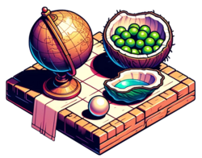  
Name: **etwas rundes** / something round  
Prompt: `Illustration with bright and saturated style, depicting an isometric square floating against a white background. The square features a wooden tabletop with a medieval ambiance. On the left side of the table is a round coconut. In the middle of the table is an ancient globe. On the right hand side of the table sits an oyster shell with a pearl nestled within it. In the font is a small tipped over cloth bag out of which green peas are spilling out on the desk. Each object is stylized and simplified, retaining the playful and imaginative feel of the setting, with a focus on bold shapes and a layered composition that adds depth.`

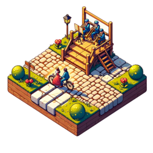  
Name: **gruppenbezeichnung** / name for a group of people  
Prompt: `Illustration of an isometric square floating against a pure white background. On the square, a small cobblestone road intersection in a medieval setting is depicted. On the road, a couple is riding on a tandem bicycle. The pedaling couple is passing by a small elevated wooden stage decorated with improvised ornaments. On the stage four musicians, a quartet, is playing brass instruments. Besides the road are small bushes and uncut grass. The colors are bright and saturated, the shapes are smooth and rounded, and the entire scene exudes warmth and coziness.`

  
Name: **gruppenbezeichnung** / name for a group of people  
Prompt: `Illustration of an isometric square floating against a pure white background. On the square, a small cobblestone road intersection in a medieval setting is depicted. On the road, a couple is riding on a tandem bicycle. The pedaling couple is passing by a small elevated wooden stage decorated with improvised ornaments. On the stage four musicians, a quartet, is playing brass instruments. Besides the road are dry bushes and grass blazing fiercely. Flames and smoke reaching into the sky. The colors are bright and saturated, the shapes are smooth and rounded, and the entire scene exudes warmth and coziness.`

  
Name: **zeitspanne** / time span  
Prompt: `Illustration of an isometric square floating against a pure white background. On the square, a wooden tabletop in a medieval setting is depicted. A tall hourglass stands proudly at the center of the tabletop, crafted from dark wood, with a round and intricate design. It holds two glass bulbs containing sand flowing from one chamber to the other. On the right side of the hourglass is an erupting miniature volcano, with realistic spewing lava casting a warm glow. Meteors are crashing onto the table, wreaking havoc. The scene is dimly lit, colorful, and stylized, with smooth, rounded shapes, exuding warmth and coziness.`

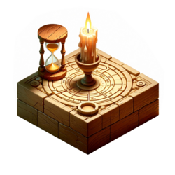  
Name: **zeitspanne** / time span  
Prompt: `Illustration of an isometric square floating against a pure white background, featuring a wooden tabletop in a medieval setting. At the center of the tabletop stands a solitary candle with finely etched time markings spiraling around it, casting a warm, gentle glow. The candle's melting wax forms small puddles at its base, symbolizing the flow of time. Beside the candle is a graceful hourglass made of aged oak with golden sand flowing between its two glass bulbs. The scene is minimalist, emphasizing the beauty of these ancient timekeepers. The colors are bright and saturated, with smooth, rounded shapes, creating an atmosphere of warmth and coziness.`

  
Name: **naturphaenomen** / natural phenomenon  
Prompt: `Illustration in an isometric view of a piece of land on a floating quadratic plate against a white background. The land, set in a medieval style, showcases three distinct natural phenomena: rain pouring down, a massive tidal wave approaching, and the mesmerizing aurora borealis lighting up the sky. The scene should have bright, saturated colors with smooth, rounded shapes to maintain a soft, friendly, and imaginative ambiance.`

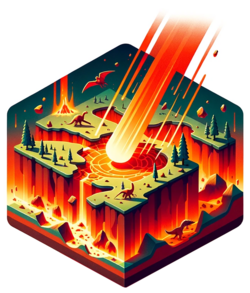  
Name: **naturkratastrophe** / natural disaster  
Prompt: `Illustration of an isometric square floating against a pure white background. The square contains a small patch of prehistoric land, capturing the moment of an asteroid's impact during the dinosaur extinction event. The impact site glows with fiery red and orange hues, signifying intense heat. Dinosaurs nearby are depicted running away, startled by the cataclysm. The landscape shows cracks, upheavals, broken and burning trees, reflecting the impact's force. Despite the dramatic moment, the composition retains smooth lines, rounded forms, and a stylized, coherent visual language. The colors are bright and saturated, with warm and cozy overtones. The background is pure white.`

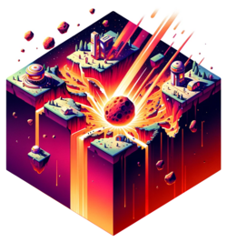  
Name: **naturkratastrophe** / natural disaster  
Prompt: `Illustration of an isometric square floating against a pure white background. Within the square, a small patch of futuristic land is depicted, capturing the moment of an asteroid's impact on human colonized Saturn. The impact site glows with fiery violet and red hues, signifying intense heat. Human Saturn dwellers nearby are shown running away, startled by the cataclysm. The landscape features cracks, upheavals, and space huts that are broken and burning, reflecting the impact's force. Despite the dramatic moment, the composition retains smooth lines, rounded forms, and a stylized, coherent visual language. The colors are bright and saturated, with warm and cozy overtones. The background is pure white.`

  
Name: **kratastrophe** / catastrophe  
Prompt: `Illustration of an isometric square floating against a pure white background. Within the square, a layered wedding cake is depicted. The scene captures the moment of asteroid impacts on the cake's top layer. The impact area glows with fiery orange and yellow hues, signifying intense heat. The chocolate bride in the vicinity is depicted melting away, caught off-guard by the sudden cataclysm. The icing is marked with cracks and upheavals, and marzipan ornaments are shown broken and burning reflecting the force of the impact. The scene conveys the chaos and severity of the event. Despite the dramatic moment, the composition retains smooth lines, rounded forms, and a stylized, coherent visual language. The colors are bright and saturated, with warm and cozy overtones. The background is pure white.`

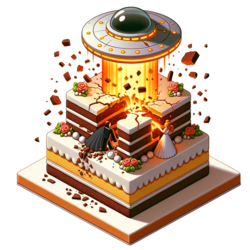  
Name: **kratastrophe** / catastrophe  
Prompt: `Illustration of an isometric square floating against a pure white background. Within the square, a layered wedding cake is depicted. The scene captures the moment of a UFO crashing into the cake's top layer. The impact area glows with fiery orange and yellow hues, signifying intense heat. The chocolate bride and groom figures are pulverized, caught off-guard by the sudden cataclysm. The icing shows cracks and upheavals, with marzipan ornaments broken and burning, reflecting the impact's force. Despite the dramatic moment, the composition retains smooth lines, rounded forms, and a stylized, coherent visual language. The colors are bright and saturated, with warm and cozy overtones. The background is pure white.`

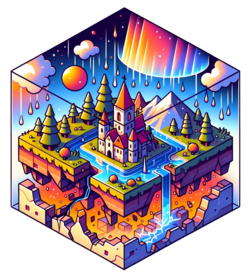  
Name: **undefiniert** / undefined  
Prompt: `Illustration showcasing an isometric square floating in mid-air against a white background. Within this square, a medieval-styled landscape is depicted, where raindrops fall from the sky, the earth trembles and fractures due to an earthquake, and the mesmerizing glow of the aurora borealis illuminates the scene. The imagery should possess bright colors, simplified, stylized designs, and smooth, rounded forms, exuding warmth and coziness.`
